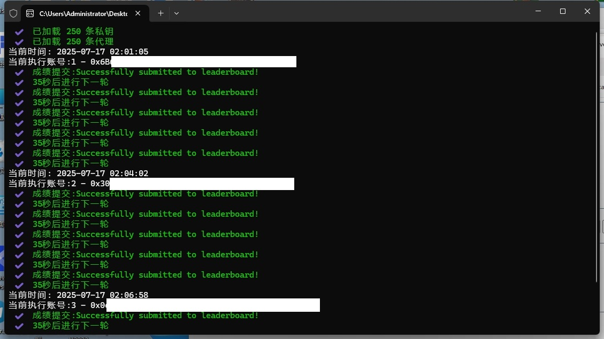

# Irys Spritetype Skrip

## 🚀 Pendahuluan
#### Ini adalah skrip mudah yang digunakan untuk secara otomatis menyelesaikan tugas game Spritetype di platform Irys.

## 📝 Deskripsi Fitur
- Saat diluncurkan, Anda dapat menyesuaikan berapa kali setiap grup akun akan menjalankan game Spritetype (N kali).
- Mendukung dua mode operasi:
  - **Mode Aman**: Jeda 35 detik di antara setiap sesi mengetik (berdasarkan frekuensi kontrol risiko game).  
  - **Mode Cepat**: Jeda 1 detik di antara setiap sesi mengetik (risiko tinggi, cocok untuk pengujian).
- Secara otomatis mengidentifikasi dan mengoreksi alamat EVM ke format checksum EIP-55 standar.
- Berjalan dalam siklus harian.
- Setelah tugas selesai, Anda dapat check-in di Galxe.  
- Secara otomatis menghitung informasi seperti akurasi, WPM, jumlah karakter.
- **Tidak memerlukan kunci pribadi**

## 🖥️ Dukungan Sistem
* Windows、Linux、macOS

## 📋 Petunjuk Penggunaan
1. Instal [.NET 9 SDK](https://dotnet.microsoft.com/download/dotnet/9.0)
```
   >  Pengguna Windows: Silakan pilih `SDK -> Windows -> x64 / x86` 
   >  Pengguna macOS: Silakan pilih SDK -> macOS -> Arm64 / x64
```
2. Buka terminal (CMD / PowerShell / Terminal), clone dan masuk ke direktori Irys:
```
clone git https://github.com/uangdrop/Irys_Spritetype.git
cd Irys_Spritetype
```
3. Jalankan skrip：
```
dotnet run
```


## 📦 Struktur File

* `Address.txt`：Setiap baris berisi satu alamat Ethereum.
* `Proxy.txt`：Setiap baris berisi satu proxy, mendukung format berikut (tidak mendukung SOCKS), Kamu bisa membeli Proxy murah di [nstproxy](https://app.nstproxy.com/register?i=G5NkUo)

```txt
ip:port
http://ip:port
https://ip:port
http://username:password@ip:port
https://username:password@ip:port
```

* `Log.txt`：Direktori yang berisi file log untuk mencatat aktivitas skrip.


## 🌌 Screenshot Saat Berjalan
Gambar di bawah ini adalah diagram antarmuka terminal saat skrip berjalan:




## 🤝 贡献指南

欢迎提交 Issues 或 Pull Requests

---


